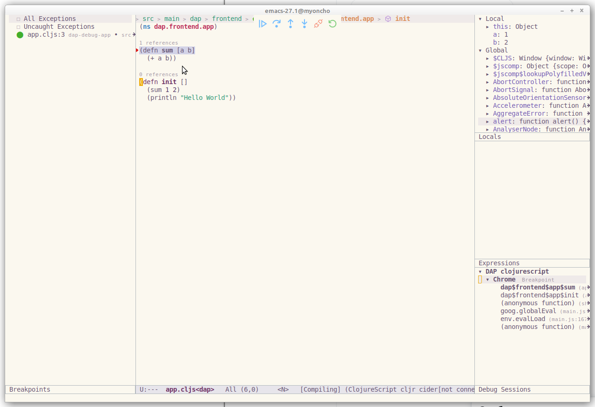

# Debugging ClojureScript using dap-mode

In this tutorial, we will cover the steps needed to debug `ClojureScript` in
`emacs` using [Google Chrome Debug Adapter](https://github.com/microsoft/vscode-chrome-debug). For general overview of Clojure
features check [Clojure Guide](clojure-guide.md).


## Requirements
* Emacs 26.1 or Emacs 27.1+ (recommended)
* node.js (v6.0.0+, most recent version preferred)
* npm (comes bundled with node.js) or yarn
* Java SDK (Version 8+, Hotspot)
* Google Chrome browser

# Sample minimal configuration

Here it is sample configuration based on the basic configuration in [Clojure Guide](clojure-guide.md).

``` emacs-lisp
(require 'package)
(add-to-list 'package-archives '("melpa" . "http://melpa.org/packages/") t)
(package-initialize)

(setq package-selected-packages '(clojure-mode lsp-mode cider lsp-treemacs flycheck company dap-mode))

(when (cl-find-if-not #'package-installed-p package-selected-packages)
  (package-refresh-contents)
  (mapc #'package-install package-selected-packages))

(add-hook 'clojure-mode-hook 'lsp)
(add-hook 'clojurescript-mode-hook 'lsp)
(add-hook 'clojurec-mode-hook 'lsp)

(setq gc-cons-threshold (* 100 1024 1024)
      read-process-output-max (* 1024 1024)
      treemacs-space-between-root-nodes nil
      company-minimum-prefix-length 1
      lsp-lens-enable t
      lsp-signature-auto-activate nil)

(with-eval-after-load 'dap-mode
  (require 'dap-chrome))
```

# Project creation

For this recipe, we will use [shadow-cljs](https://github.com/thheller/shadow-cljs).

* Install `npx`

``` bash
$ npm install -g npx
```

* Create the sample project
``` bash
$ npx create-cljs-project dap-debug-app
npx: installed 1 in 1.764s
shadow-cljs - creating project: /home/yyoncho/Sources/dap-debug-app
Creating: /home/yyoncho/Sources/dap-debug-app/package.json
Creating: /home/yyoncho/Sources/dap-debug-app/shadow-cljs.edn
Creating: /home/yyoncho/Sources/dap-debug-app/.gitignore
Creating: /home/yyoncho/Sources/dap-debug-app/src/main
Creating: /home/yyoncho/Sources/dap-debug-app/src/test
----
Installing shadow-cljs in project.

npm notice created a lockfile as package-lock.json. You should commit this file.
+ shadow-cljs@2.11.23
added 100 packages from 106 contributors and audited 100 packages in 4.831s

3 packages are looking for funding
  run `npm fund` for details

found 0 vulnerabilities
```

# Emacs

Create and open file `src/main/dap/frontend/app.cljs` and make sure that `clojure-lsp` language
server is up and running.

Add the following content:

```clojure
(ns dap.frontend.app)

(defn sum [a b]
  (+ a b))

(defn init []
  (sum 1 2)
  (println "Hello World"))
```

Inside the `shadow-cljs.edn` `:builds` section add

```clojure
{...
 :builds
 {:frontend
  {:target :browser
   :modules {:main {:init-fn dap.frontend.app/init}}
   }}}
```

This config tells the compiler to call `(dap.frontend.app/init)` when the
generated JS code is loaded. Since no `:output-dir` is configured the default
`public/js` is used. You can start the development process by running:

``` bash
$ npx shadow-cljs watch frontend
...
a few moments later ...
...
[:frontend] Build completed. (134 files, 35 compiled, 0 warnings, 5.80s)
```

Once the config is saved the server will automatically start and serve the
content at http://localhost:8080. There is no need to restart shadow-cljs. When
opening the above URL the Browser Console should show "Hello World".


## Debugging

The first step is install [Google Chrome Debug Adapter](https://github.com/microsoft/vscode-chrome-debug) via **M-x dap-chrome-setup**. This is one time operation.

Then create file `launch.json` with the following content:

```json
{
    "version": "0.2.0",
    "configurations": [
        {
            "type": "chrome",
            "request": "launch",
            "name": "DAP clojurescript",
            "url": "http://localhost:8080",
            "sourceMaps": true,
            "webRoot": "${workspaceFolder}",
            "sourceMapPathOverrides": {
                "*": "${workspaceFolder}/src/main/*"
            }
        }
    ]
}
```

Then open `app.cljs` and place some breakpoints either by clicking in the fringe
or by doing `M-x dap-breakpoint-toggle`.

After doing that, you can do `M-x dap-debug` and select `DAP clojurescript`.



You may find the complete project sources at https://github.com/yyoncho/dap-debug-app

## See also
- [dap-mode](https://github.com/emacs-lsp/dap-mode)
- [shadown-cljs](https://github.com/thheller/shadow-cljs)
